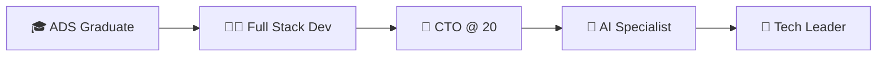

<!-- Header Animado -->


<!-- Typing Animation -->
<div align="center">
  
[](https://git.io/typing-svg)

</div>

<!-- Social Links com animação -->
<div align="center">
  
  [](mailto:douglasmelere@gmail.com)
  [](https://www.linkedin.com/in/douglas-junior-22840b2a4/)
  [](https://wa.me/+5549999330101)
  [](https://www.instagram.com/douglasmelere)
  
</div>

<!-- Linha Animada -->


## 🎯 **About Me**


<br>

```javascript
const douglas = {
  role: "CTO @ PagLuz",
  age: 20,
  location: "Luzerna, SC - Brasil",
  
  education: {
    completed: ["ADS", "Técnico em Informática"],
    inProgress: ["Engenharia de Software", "Pós em Data Science & AI"]
  },
  
  currentFocus: {
    work: "Liderando inovação em energia renovável",
    tech: ["React", "Node.js", "TypeScript", "Machine Learning"],
    goals: ["Escalar sistemas", "Aplicar IA no setor energético"]
  },
  
  funFact: "Alcancei o cargo de CTO aos 20 anos! 🚀"
};
```

<br clear="right"/>

<!-- Estatísticas Animadas -->


## 📊 **GitHub Analytics**

<div align="center">
   
  
  
</div>

<div align="center">
  
</div>

<!-- Gráfico de Contribuições -->
<div align="center">
  
</div>


## 🛠️ **Tech Stack & Tools**

<div align="center">

### 🎨 **Frontend Magic**


### ⚙️ **Backend Power**


### 🗄️ **Database Solutions**


### 🤖 **AI & Data Science**


### 🔧 **DevOps & Tools**


</div>


## 💼 **Professional Journey**

<details>
<summary><b>🏢 Chief Technology Officer @ PagLuz</b></summary>
<br>

<div align="center">
  
| 🎯 **Responsabilidades** | 🚀 **Realizações** |
|:------------------------:|:------------------:|
| Liderança técnica e estratégica | 3 sistemas em produção |
| Arquitetura de sistemas escaláveis | Automação completa de processos |
| Gestão de equipe de desenvolvimento | Integração de IA no setor energético |
| Decisões tecnológicas da empresa | CTO aos 20 anos |

</div>

### **🌟 Projetos em Destaque**

<div align="center">
  
[](https://clients.pagluz.com.br)

[](https://contracts.pagluz.com.br)

[](https://pagluz.com.br)

</div>

</details>


## 🏆 **Achievements & Certifications**

<div align="center">



</div>

<div align="center">
  
| 🏅 **Conquista** | 📅 **Status** |
|:----------------:|:-------------:|
| Graduação em ADS | ✅ Concluído |
| Técnico em Informática | ✅ Concluído |
| CTO na PagLuz | ✅ Ativo |
| Engenharia de Software | 📚 Em andamento |
| Pós em Data Science & AI | 📚 Em andamento |
| 3 Sistemas em Produção | ✅ Entregue |

</div>


## 💡 **Philosophy & Vision**

<div align="center">

### *"Código limpo, arquitetura sólida, inovação constante"*


</div>


## 📈 **Contribution Snake**

<div align="center">
  <picture>
    <source media="(prefers-color-scheme: dark)" srcset="https://raw.githubusercontent.com/platane/platane/output/github-contribution-grid-snake-dark.svg">
    <source media="(prefers-color-scheme: light)" srcset="https://raw.githubusercontent.com/platane/platane/output/github-contribution-grid-snake.svg">
    
  </picture>
</div>


## 🤝 **Let's Connect!**

<div align="center">
  
### 💬 *"Sempre aberto para colaborações e novas ideias!"*

<a href="mailto:douglasmelere@gmail.com">
  
</a>
<a href="https://www.linkedin.com/in/douglas-junior-22840b2a4/">
  
</a>
<a href="https://wa.me/+5549999330101">
  
</a>

</div>


<!-- Profile Views Counter -->
<div align="center">
  
### **👀 Profile Views**
  


### **⚡ Fun Fact**
[](https://github.com/douglasmelere)

</div>

<!-- Footer Wave -->

